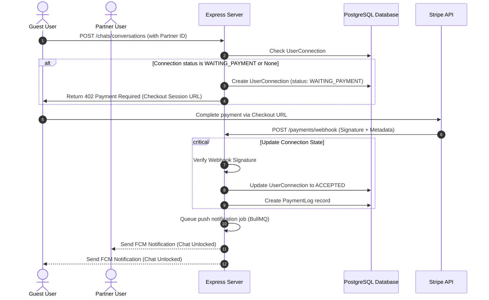

# Stripe Payment Whitelisting System Implementation Plan

> **For Claude:** REQUIRED SUB-SKILL: Use superpowers:executing-plans to implement this plan task-by-task.

**Goal:** Integrate Stripe payments so that communication (chat, voice calling, and video calling) is unlocked for the initiator (guest) and target user (partner) only after a successful connection payment checkout.

**Node.js Backend & Flutter Frontend Split:**

- **Backend (Node.js, Express, TypeScript)**:
  - Generates secure Stripe Checkout Sessions (`POST /api/v1/payments/checkout`) containing metadata details (buyer ID, partner ID, connection ID).
  - Exposes dynamic raw-parser endpoint (`POST /api/v1/payments/webhook`) receiving Stripe webhook notifications.
  - Verifies signatures cryptographically using `stripe.webhooks.constructEvent` with webhook signing secrets.
  - Runs transactional SQL updates (Prisma) transitioning connection status to `ACCEPTED` and logging transaction details.
- **Frontend (Flutter Mobile App)**:
  - Hits `/api/v1/payments/checkout` to get the redirect URL when initiating chats with non-whitelisted users.
  - Launches standard in-app Stripe Payment Sheets (`flutter_stripe`) or redirects to checkout URLs.
  - Listens to successful transaction FCM push alerts to trigger direct connection activations.

**Budget-Oriented & Free Tier Services:**

- **Payment Processor**: **Stripe** (Pay-as-you-go: **$0 setup or monthly fees**, 2.9% + $0.30 per successful transaction). You only pay when you make a sale.
- **Backend SDK**: Official **stripe** package for Node.js.
- **Flutter UI Integration**: **flutter_stripe** (pub.dev) supporting secure native iOS and Android Stripe payment sheet triggers.

**Architecture:**

- **Connection Pending State**: When a user attempts to chat or call another user without an existing connection, a `UserConnection` record is generated in a `WAITING_PAYMENT` state.
- **Stripe Checkout Session**: Initiating communication redirects the user to a secure Stripe checkout session (`POST /api/v1/payments/checkout`). Session metadata securely locks the buyer's ID and target partner's ID.
- **Secure Webhook Verification**: Stripe triggers a webhook on `/api/v1/payments/webhook`. The endpoint strictly verifies signatures using `stripe.webhooks.constructEvent` with the raw request buffer to prevent spoofing.
- **Transaction-Safe Whitelisting**: Upon receiving `checkout.session.completed`, the backend opens a database transaction to:
  1. Transition `UserConnection` status from `WAITING_PAYMENT` to `ACCEPTED` (instantly enabling chat, audio calls, and video calls).
  2. Create a persistent `PaymentLog` audit trail.
- **Notification Trigger**: Enqueues a notification job in BullMQ to send FCM push alerts to both users notifying them that connection access is unlocked.

**Tech Stack:** Node.js, Express, TypeScript, Prisma (PostgreSQL), Stripe Node SDK, Redis (BullMQ).

Flutter Client Compatibility Rules:

- **Mobile Deep-Linking Redirects**: During Stripe Checkout Session creation, the `success_url` and `cancel_url` parameters must accept deep-link schemas (`myapp://payment-success` or verified Android App Links / iOS Universal Links) so the mobile browser returns the user directly back into the Flutter app target view upon payment completion.
- **Webhook Idempotency & Pushes**: Since webhook retries are common, the webhook controller must perform database validation against `stripeSessionId` in `PaymentLog` before updating states to prevent multiple event emissions. Upon success, FCM push notifications must immediately alert the receiver's Flutter background services to activate conversation permissions without requiring app restarts.

---

## Payment Whitelisting Flow



---

## Detailed Component Plans

### Task 1: Database Migration & Schema Design (Payments & Connections)

Add payment logging models and update connection state values.

**Files:**

- Modify: `src/database/prisma/schema.prisma`
- Test: `tests/database/payment.schema.test.ts`

**Step 1: Write the failing test**
Create a test asserting connection updates to `WAITING_PAYMENT` status and creation of `PaymentLog` records.

Create `tests/database/payment.schema.test.ts`:

```typescript
import { db } from '../../src/database/db';

describe('Payment Whitelisting Database Schema', () => {
  it('should successfully store payment logs and transition connection status', async () => {
    const u1 = await db.user.create({ data: { email: 'buyer@test.com' } });
    const u2 = await db.user.create({ data: { email: 'target@test.com' } });

    const connection = await db.userConnection.create({
      data: { requesterId: u1.id, receiverId: u2.id, status: 'WAITING_PAYMENT' }
    });
    expect(connection.status).toBe('WAITING_PAYMENT');

    const log = await db.paymentLog.create({
      data: {
        userId: u1.id,
        connectionId: connection.id,
        stripeSessionId: 'cs_test_123',
        amount: 2999, // $29.99 in cents
        currency: 'usd',
        status: 'PAID',
      }
    });
    expect(log.amount).toBe(2999);

    // Clean up
    await db.paymentLog.delete({ where: { id: log.id } });
    await db.userConnection.delete({ where: { id: connection.id } });
    await db.user.deleteMany({ where: { id: { in: [u1.id, u2.id] } } });
  });
});
```

**Step 2: Run test to verify it fails**
Run: `npm test tests/database/payment.schema.test.ts`

**Step 3: Write minimal implementation**

1. Append the `PaymentLog` model to `src/database/prisma/schema.prisma`:

```prisma
model PaymentLog {
  id              String         @id @default(uuid()) @db.Uuid
  userId          String         @db.Uuid
  connectionId    String         @db.Uuid
  stripeSessionId String         @unique
  amount          Int            // in cents
  currency        String
  status          String         // PAID, REFUNDED, FAILED
  createdAt       DateTime       @default(now())

  user            User           @relation(fields: [userId], references: [id], onDelete: Cascade)
  connection      UserConnection @relation(fields: [connectionId], references: [id], onDelete: Cascade)

  @@map("payment_logs")
}
```

1. Update relations:

- Add `paymentLogs PaymentLog[]` to the `User` model.
- Add `paymentLogs PaymentLog[]` to the `UserConnection` model.

Run schema migration:

```bash
npm run prisma:generate
npm run prisma:migrate -- --name add_payment_schemas
```

**Step 4: Run test to verify it passes**
Run: `npm test tests/database/payment.schema.test.ts`

**Step 5: Commit**

```bash
git add src/database/prisma/schema.prisma tests/database/payment.schema.test.ts
git commit -m "db: implement PaymentLog schema and WAITING_PAYMENT status mapping"
```

---

### Task 2: Stripe Integration Setup & Environment Configurations

Install the Stripe Node SDK and configure environment parameters for secure keys.

**Files:**

- Modify: `src/config/env.ts`
- Modify: `.env.example`
- Modify: `package.json`

**Step 1: Install stripe npm package**
Run: `npm install stripe`

**Step 2: Write minimal implementation**

1. Update `src/config/env.ts` configurations:

```typescript
// Inside env.ts, append:
STRIPE_SECRET_KEY: process.env.STRIPE_SECRET_KEY || '',
STRIPE_WEBHOOK_SECRET: process.env.STRIPE_WEBHOOK_SECRET || '',
STRIPE_CONNECTION_PRICE_ID: process.env.STRIPE_CONNECTION_PRICE_ID || '', // Price ID for connection purchase
CLIENT_URL: process.env.CLIENT_URL || 'http://localhost:4000', // Redirect Flutter app target deep-links
```

1. Update `.env` and `.env.example`:

```env
STRIPE_SECRET_KEY=sk_test_...
STRIPE_WEBHOOK_SECRET=whsec_...
STRIPE_CONNECTION_PRICE_ID=price_...
CLIENT_URL=myapp://payment-redirect
```

**Step 3: Commit**

```bash
git add src/config/env.ts .env.example package.json
git commit -m "config: configure stripe sdk environment variables"
```

---

### Task 3: Stripe Checkout Session API Integration

Implement checkout endpoints to redirect standard user connection requests to Stripe Checkout.

**Files:**

- Create: `src/modules/payments/payment.service.ts`
- Create: `src/modules/payments/payment.controller.ts`
- Create: `src/modules/payments/payment.validator.ts`
- Create: `src/modules/payments/payment.routes.ts`
- Modify: `src/routes/index.ts`
- Test: `tests/modules/payments/checkout.api.test.ts`

**Step 1: Write the failing test**
Create `tests/modules/payments/checkout.api.test.ts` checking that requesting a checkout session returns the session redirect URL.

**Step 2: Run test to verify it fails**
Run: `npm test tests/modules/payments/checkout.api.test.ts`

**Step 3: Write minimal implementation**

1. Create `src/modules/payments/payment.service.ts`:

```typescript
import Stripe from 'stripe';
import { env } from '../../config/env';
import { db } from '../../database/db';
import { NotFoundError } from '../../core/errors/custom-errors';

const stripe = new Stripe(env.STRIPE_SECRET_KEY, { apiVersion: '2024-04-10' as any });

export class PaymentService {
  async createCheckoutSession(userId: string, recipientId: string) {
    const recipient = await db.user.findFirst({ where: { id: recipientId, deletedAt: null } });
    if (!recipient) {
      throw new NotFoundError('Recipient user not found');
    }

    // 1. Get or create connection in WAITING_PAYMENT status
    const connectionKey = [userId, recipientId].sort().join('_');
    const connection = await db.userConnection.upsert({
      where: { requesterId_receiverId: { requesterId: userId, receiverId: recipientId } },
      update: {},
      create: {
        requesterId: userId,
        receiverId: recipientId,
        status: 'WAITING_PAYMENT',
      },
    });

    // 2. Build Stripe Checkout Session
    const session = await stripe.checkout.sessions.create({
      payment_method_types: ['card'],
      line_items: [
        {
          price: env.STRIPE_CONNECTION_PRICE_ID,
          quantity: 1,
        },
      ],
      mode: 'payment',
      success_url: `${env.CLIENT_URL}/success?connectionId=${connection.id}`,
      cancel_url: `${env.CLIENT_URL}/cancel`,
      metadata: {
        requesterId: userId,
        receiverId: recipientId,
        connectionId: connection.id,
      },
    });

    return { checkoutUrl: session.url };
  }
}

export const paymentService = new PaymentService();
```

1. Implement Controller, Zod Validator, and routes mapping in `src/modules/payments/`. Mount router under `/payments` prefix in `src/routes/index.ts`.

**Step 4: Run test to verify it passes**
Run: `npm test tests/modules/payments/checkout.api.test.ts`

**Step 5: Commit**

```bash
git add src/modules/payments/ src/routes/index.ts tests/modules/payments/checkout.api.test.ts
git commit -m "feat: implement Stripe checkout session generation for connections"
```

---

### Task 4: Secure Stripe Webhook Validation & Whitelisting Trigger

Process incoming Stripe webhook payloads. Validate signatures using Stripe secrets, update connection status to `ACCEPTED` in ACID transactions, and enqueue push triggers.

**Files:**

- Modify: `src/modules/payments/payment.routes.ts`
- Modify: `src/modules/payments/payment.controller.ts`
- Modify: `src/app.ts`
- Test: `tests/modules/payments/webhook.test.ts`

**Step 1: Write the failing test**
Create `tests/modules/payments/webhook.test.ts` mock-submitting `checkout.session.completed` events and checking that the target connection gets updated to `ACCEPTED`.

**Step 2: Run test to verify it fails**
Run: `npm test tests/modules/payments/webhook.test.ts`

**Step 3: Write minimal implementation**

1. Update `src/app.ts` to support raw body parsing for the Webhook endpoint (required by Stripe to construct cryptographic signatures):

```typescript
// Add inside src/app.ts, BEFORE general body parsers:
app.use(
  '/api/v1/payments/webhook',
  express.raw({ type: 'application/json' })
);
```

1. Add the webhook route and controller method in `src/modules/payments/`:

```typescript
import Stripe from 'stripe';
import { db } from '../../database/db';
import { notificationQueue } from '../../jobs/queue';

const stripe = new Stripe(env.STRIPE_SECRET_KEY, { apiVersion: '2024-04-10' as any });

// In controller
async handleWebhook(req: Request, res: Response, next: NextFunction) {
  const sig = req.headers['stripe-signature'];
  let event: Stripe.Event;

  try {
    event = stripe.webhooks.constructEvent(
      req.body, // Must be the raw request buffer
      sig as string,
      env.STRIPE_WEBHOOK_SECRET
    );
  } catch (err: any) {
    logger.error('Webhook signature validation failed:', err);
    return res.status(400).send(`Webhook Error: ${err.message}`);
  }

  try {
    if (event.type === 'checkout.session.completed') {
      const session = event.data.object as Stripe.Checkout.Session;
      const { requesterId, receiverId, connectionId } = session.metadata || {};

      if (!requesterId || !receiverId || !connectionId) {
        throw new Error('Missing metadata in Stripe Session object');
      }

      // Update connection status inside database transaction
      await db.$transaction(async (tx) => {
        await tx.userConnection.update({
          where: { id: connectionId },
          data: { status: 'ACCEPTED' },
        });

        await tx.paymentLog.create({
          data: {
            userId: requesterId,
            connectionId,
            stripeSessionId: session.id,
            amount: session.amount_total || 0,
            currency: session.currency || 'usd',
            status: 'PAID',
          },
        });
      });

      logger.info(`💳 Whitelisted connection ${connectionId} between ${requesterId} and ${receiverId}`);

      // Dispatch FCM Push triggers to alert both users
      await notificationQueue.add('sendPush', {
        userId: requesterId,
        title: 'Connection Unlocked!',
        message: 'Your connection has been accepted, you can now start messaging and calling.',
        type: 'PUSH',
      });

      await notificationQueue.add('sendPush', {
        userId: receiverId,
        title: 'New Connection Available!',
        message: 'A new user connection is active and available.',
        type: 'PUSH',
      });
    }

    return res.status(200).json({ received: true });
  } catch (error) {
    return next(error);
  }
}
```

**Step 4: Run test to verify it passes**
Run: `npm test tests/modules/payments/webhook.test.ts`

**Step 5: Commit**

```bash
git add src/modules/payments/ src/app.ts tests/modules/payments/webhook.test.ts
git commit -m "feat: add secure Stripe webhook validation and payment status trigger hooks"
```
